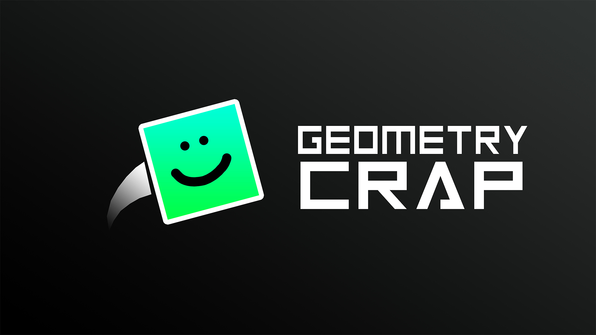

# GeometryCrap

## A játékról
Ha te is szereted a Geometry Dasht és új kihívásokra vágysz, akkor ez a Te játékod. Az alapok maradtak, viszont néhány új elemet hozzáadtam. Ezen felül saját pályákat is szerkeszthetsz.

### Irányítás:
SPACE - ugrás
ESC - visszalépés menüben

### Új játékelemek:
- Dupla ugrás
- A "Láthatatlan fal": van hitboxa, de úgy néz ki, mint a levegő
- Az "Álfal": nincs hitboxa, de úgy néz ki, mint egy fal
- Ágyú
- Portál: párban vannak, egyik végéből átdob a másikba próbálkozásonként egyszer

https://youtu.be/NvVdOJ1UEQ0

## Letöltés és futtatás
Az alábbi fájlok szükségesek:
- Assets (mappa): a játékban lévő zenék, képek és egyéb fájlok helye
- GeoCrap (alkalmazás): ezt kell majd futtatni
- openal32.dll : zene lejátszásához szükséges könyvtár

Ezeket letöltheted erről az oldalról (Executable mappa), vagy ezen a [Dropbox linken](https://www.dropbox.com/sh/k5bud2vt4z06jay/AAC56qix2ZODmiCfQTppPQkKa?dl=0).

## Visszajelzés
Ha kipróbáltad a játékot, nagyon örülnék, ha kitöltenéd ezt az űrlapot: https://forms.gle/5zwFYuiDipNDt69DA

Jelenleg lehet néhány hiba a programban, ha észlelsz valamit, akkor küldd el nekem.
Ha csináltál egy menő pályát, vagy van valami javaslatod és azt szeretnéd megosztani a többi játékossal, akkor azt is elküldheted.

david.meljan@gmail.com

## Zenék
- Keppel Skies - Fiberman, Pablo 4
- Mar Vei - Mind, Steps on Water

## Keretrendszer
C++20 & SFML (2.5.1)
https://www.sfml-dev.org/
